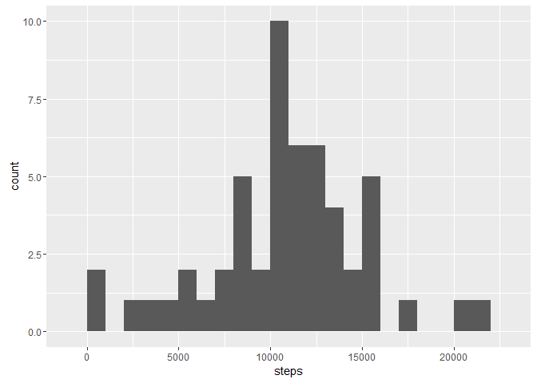
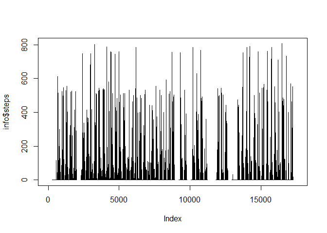
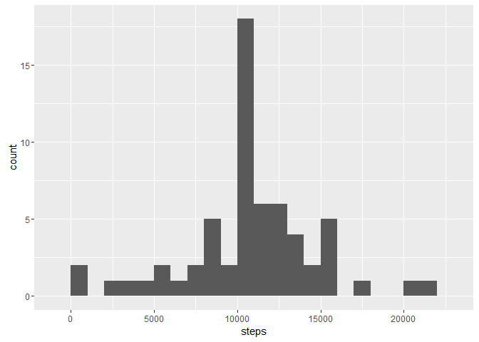

# Reproducible Research: Peer Assessment 1


## Loading and preprocessing the data


```r
info = read.csv('activity/activity.csv', stringsAsFactor=FALSE)
info = mutate(info, day=weekdays(as.Date(date)))
```


## What is mean total number of steps taken per day?
The fist step is to obtain the total number of steps for each day filtering the NA values:

```r
steps<-info%>%select(steps,date)%>%filter(!is.na(steps))%>%group_by(date)%>%summarise_each(funs(sum))
```

The histogram is obtained usign ggplot. The graphic shows that most of the days the number of steps around 10000.


```r
g <- ggplot(steps,aes(x=steps))
g + geom_histogram(binwidth=1000)
```

 

Then we can obtain the mean and the median whith the respective functions

```r
#Mean
mean(steps$steps)
```

```
## [1] 10766.19
```

```r
#Median
median(steps$steps)
```

```
## [1] 10765
```


## What is the average daily activity pattern?

Plotting the number of steps in the 5 minutes interval shows the folloing graphic:


```r
plot(info$steps,type="l")
```

 

The maximum number of steps in a 5 minutes interval is:

```r
max_steps <- max(info$steps,na.rm=TRUE)
max_steps
```

```
## [1] 806
```
This interval appears in:

```r
max_days <- info%>%select(steps,date,interval)%>%filter(steps==max_steps)
max_days
```

```
##   steps       date interval
## 1   806 2012-11-27      615
```

## Imputing missing values
Using the library dplyr is possible to filter the NAs, then we can count its number.

```r
nas = info %>% select(steps) %>% filter(is.na(steps))
nrow(nas)
```

```
## [1] 2304
```

We are going to fill replace the NAs in the data with the mean of the 5 minute steps

```r
mean_steps <- mean(info$steps,na.rm=TRUE)
nas = which(is.na(info$steps))
info2 <- info
info2[nas,1] <- mean_steps
```

Once the NAs are replaced we can make a new histogram

```r
steps2<-info2%>%select(steps,date)%>%group_by(date)%>%summarise_each(funs(sum))
g <- ggplot(steps2,aes(x=steps))
g + geom_histogram(binwidth=1000)
```

 

In this histogram we can see there are more samples around 10000 steps with respect to the last graphic.

## Are there differences in activity patterns between weekdays and weekends?

